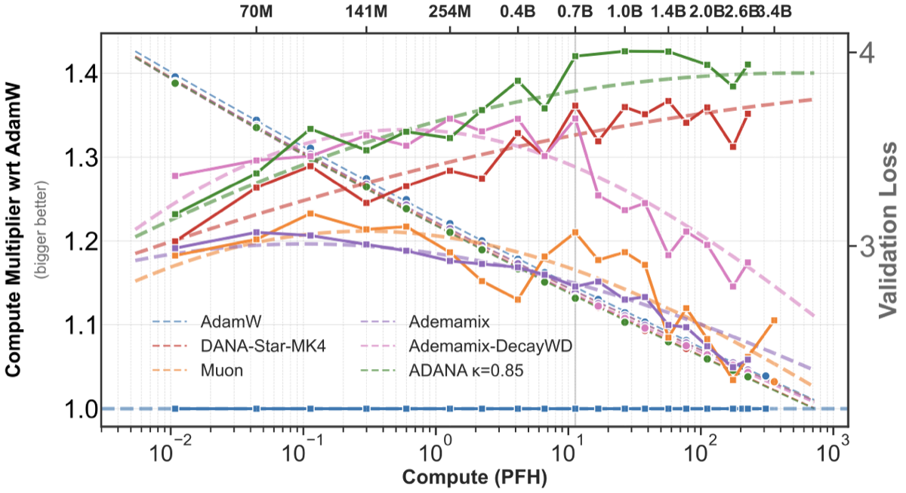
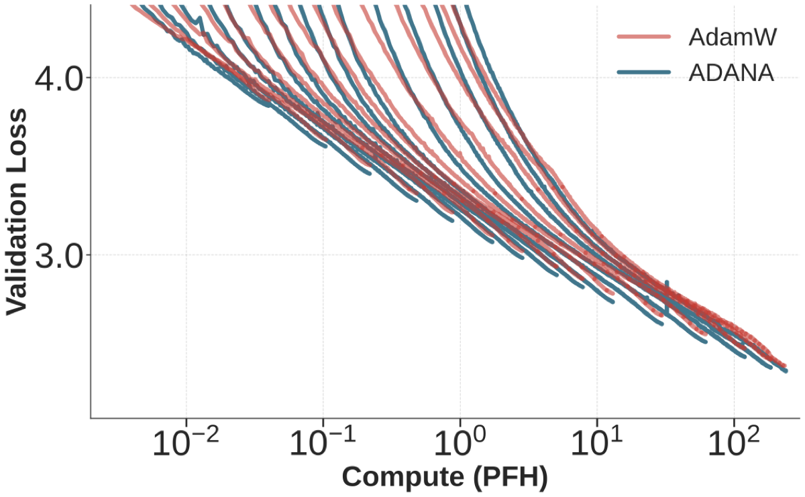

# ADana: Logarithmic-Time Schedules for Scaling Language Models with Momentum

[](https://arxiv.org/abs/2602.05298)

**ADana** (Adaptive Damped Nesterov Acceleration) is a drop-in modification of AdamW that replaces fixed momentum and weight-decay constants with *logarithmic-time schedules* and a *damped Nesterov acceleration*. These changes are motivated by the power-law structure of language: the per-token entropy of natural language decays as a power law in context length, so the optimizer's effective memory should grow with training time rather than remain fixed.

<p align="center">
  
</p>

**Figure:** Scaling laws and compute efficiency vs. compute for ADana variants on FineWeb. **Left axis:** compute-efficiency relative to AdamW. ADana's benefits increase with scale, reaching ~40% compute savings. **Right axis:** validation loss as a function of compute, fit to a broken power law.

## How it works

ADana modifies AdamW with three schedule changes:

1. **Log-time momentum** for both 1st and 2nd moments:

$$\beta_1(t) = \beta_2(t) = 1 - \frac{\delta}{\delta + t}$$

2. **Decaying weight decay:**

$$\lambda(t) = \frac{\omega}{t}$$

3. **Damped Nesterov acceleration:**

$$\alpha(t) = (1 + t)^{1 - \kappa}$$

where $\kappa \approx 0.85$ is a spectral dimension parameter, $\delta \approx 8$ controls the EMA timescale, and $\omega \approx 4$ sets the weight-decay strength. These hyperparameters are designed to be **scale-invariant** -- they do not need to be retuned across model sizes.

The update rule at each step is:

$$\theta_{t+1} = \theta_t - \gamma(t) \left( \gamma^* \cdot \frac{g_{t+1} + \alpha(t) \cdot m_{t+1}}{\sqrt{v_{t+1}} + \epsilon} + \lambda(t) \cdot \theta_t \right)$$

where $m_{t+1}$ and $v_{t+1}$ are the usual first and second moment estimates with time-varying $\beta$ coefficients, $\gamma^*$ is the peak learning rate, and $\gamma(t)$ is the LR schedule.

## Key results

<p align="center">
  
</p>

**Figure:** Validation loss over training across scales from 45.7M to 2.62B parameters for AdamW and ADana on FineWeb. ADana shows better loss along the majority of training, especially at larger scales.

- **Up to ~40% compute savings** over AdamW, with gains that *increase* with model scale
- **~10% compute savings** from log-time weight-decay scheduling alone (applicable to any optimizer)
- **No extra hyperparameters** compared to AdamW -- same count, just different functional forms
- **No architectural changes** needed -- works with any architecture tuned for AdamW
- Benchmarked against AdamW, Muon, and AdEMAMix on scaling ladders of decoder-only transformers (45M--2.6B params) at Chinchilla-optimal token budgets

## Variants

| Variant | Description | PyTorch | Optax (JAX) |
|---------|-------------|---------|-------------|
| **ADana** | Base: log-time momentum, decaying WD, damped Nesterov | [`src/optim/adana.py`](src/optim/adana.py) | [`jax/optimizers.py`](jax/optimizers.py#L208) |
| **Dana-MK4** | + SNR clipping to reduce sensitivity to $\kappa$ | [`src/optim/adana.py`](src/optim/adana.py) | [`jax/optimizers.py`](jax/optimizers.py#L377) |
| **Dana-Star** | + $\tau$ estimator for robustness to sparse gradients | [`src/optim/dana_star_mk4.py`](src/optim/dana_star_mk4.py) | [`jax/optimizers.py`](jax/optimizers.py#L69) |
| **Dana-Star-MK4** | Both SNR clipping and $\tau$ estimator | [`src/optim/dana_star_mk4.py`](src/optim/dana_star_mk4.py) | [`jax/optimizers.py`](jax/optimizers.py#L572) |

## Getting started

See [QUICKSTART.md](QUICKSTART.md) for installation, data preparation, and training instructions.

```bash
# Install
pip install -r requirements.txt

# Train with ADana (single GPU, small model)
bash scripts/launch.sh --arch enoki --opt adana --heads 3

# Train with Dana-Star-MK4 (multi-GPU)
bash scripts/launch.sh --arch enoki --opt dana-star-mk4 --heads 12 \
  --nproc 4 --distributed_backend fsdp
```

## Citation

```bibtex
@article{paquette2026logarithmic,
  title={Logarithmic-time Schedules for Scaling Language Models with Momentum},
  author={Ferbach, Damien and Paquette, Courtney and Gidel, Gauthier and Everett, Katie and Paquette, Elliot},
  journal={arXiv preprint arXiv:2602.05298},
  year={2026}
}
```

## Acknowledgments

This codebase is adapted from [llm-optimizer-benchmark](https://github.com/epfml/llm-optimizer-benchmark) by EPFL ML.

## License

See [LICENSE](LICENSE).
